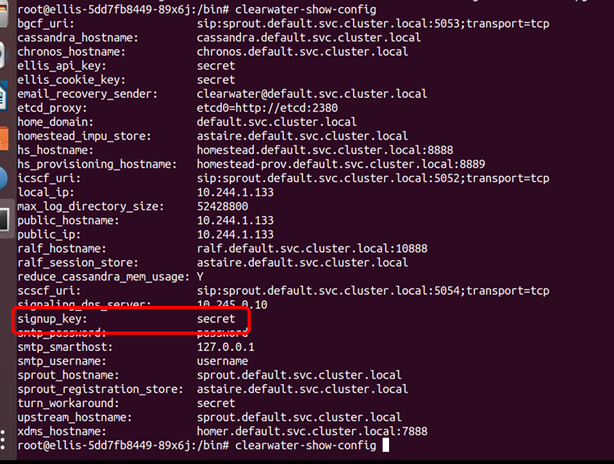

# Clearwater on K8s

## 參考的連結

[clearwater deployment yaml file](https://gerrit.opnfv.org/gerrit/gitweb?p=functest-kubernetes.git;a=tree;f=functest_kubernetes/ims;h=a29ecd511a94614b1e2133b5eeee30d964cb31e0;hb=refs/changes/75/71175/1)

[clearwater container images ( ollivier/clearwater : hunter )](https://gerrit.opnfv.org/gerrit/gitweb?p=functest-kubernetes.git;hb=cae5c11636142345aa61c1f14d501f825d87d4cd;f=functest_kubernetes%2Fci%2Fdownload_images.sh)

## clearwater
1. 相依關係 :

    → : 安裝順序

    ( ) : 相依的元件
    
    etcd → cassandra (etcd) → astaire (cassandra) → chronos (cassandra) → homer (cassandra) → homestead (cassandra、astaire) → homestead-prov (homestead) → ralf (cassandra) → sprout (ralf、chronos、homestead) → bono (sprout)

1. Ellis 註冊帳號的時候 Singup code 是 "secret"，可以進入到 Ellis 的 container 中 /bin/clearwater-show-config 裡面查到
    
    

## Download container's images ( ollivier : hunter )

```docker
sudo docker pull docker.io/ollivier/clearwater-astaire:hunter 
sudo docker pull docker.io/ollivier/clearwater-bono:hunter 
sudo docker pull docker.io/ollivier/clearwater-cassandra:hunter 
sudo docker pull docker.io/ollivier/clearwater-chronos:hunter 
sudo docker pull docker.io/ollivier/clearwater-ellis:hunter 
sudo docker pull docker.io/ollivier/clearwater-homer:hunter 
sudo docker pull docker.io/ollivier/clearwater-homestead:hunter 
sudo docker pull docker.io/ollivier/clearwater-homestead-prov:hunter 
sudo docker pull docker.io/ollivier/clearwater-live-test:hunter 
sudo docker pull docker.io/ollivier/clearwater-ralf:hunter 
sudo docker pull docker.io/ollivier/clearwater-sprout:hunter 
```

## 遇到的錯誤

1. 進入pod 檢查 ssupervisorctl status，只看k8s get pod 有可能看起來running正常，但裡面組件exited
    
    ```bash
    supervisorctl status
    ```
    這是正常的，因為安裝的版本並非特別為container設計，所以元件有些部分在host端執行才會正常，無法在容器中正常執行，不影響後續的打電話功能